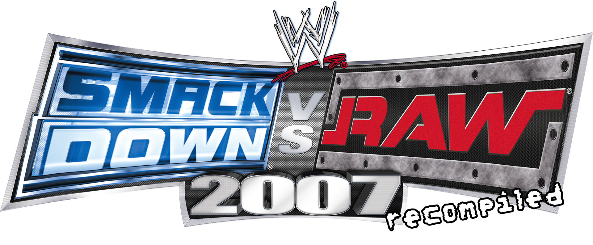

<p align="center">
  
</p>

# SVR07-Recomp

A static recompilation of **WWE SmackDown vs. Raw 2007** (Xbox 360) that runs natively on Windows.

Built on top of [RexGlue](https://github.com/HollywoodAkeem/rexglue-sdk-yukes), an Xbox 360 PPC-to-x64 recompilation runtime.

▶ [Reveal trailer](https://youtu.be/ozP0BlBFnlI) · [Earlier demo](https://www.youtube.com/watch?v=iTuGEyXiP64)

---

## Status

The game is **playable end-to-end** at a stable 60 FPS, matching the behavior of the retail Xbox 360 release.

Recent fixes:

- **Save system** — saves now load and persist correctly between sessions.
- **Clock-rate desync** — the game was previously rendering well above 100 FPS while its internal simulation clock ran at half speed. Resolved.

### What works

- Full game loop: menus, match types, create-a-superstar, season mode, etc.
- 60 FPS, 1:1 with retail timing
- Save / load
- Controller input (XInput)

### Known issues

- Occasional vertex artifacts on skinned wrestler models (under investigation upstream in RexGlue)
- Internal game resolution and aspect ratio are currently locked to the 360 defaults; the recomp's renderer supports output at up to 4× internal resolution (4K) on capable hardware. Arbitrary internal resolution and aspect ratio support is on the roadmap.
- Some indirect PPC calls still fall through to a generic dispatcher (`PPC_CALL_INDIRECT_FUNC`) — being squashed over time
- Roughly a 10% chance per session of a random crash where the host GPU device is lost (D3D12 device-removed / disconnect). Cause not yet root-caused; relaunch the game to recover.

---

## Requirements

- **Operating System**: 
  - **Windows 10 or 11 (x64)**
  - **Linux (x64)** (tested on Fedora 44, compatible with major distributions)
- **Graphics API / GPU**:
  - Windows: **DirectX 12 capable GPU** (driver must support D3D12)
  - Linux: **Vulkan capable GPU** (driver must support Vulkan 1.3+)
- **Game Files**:
  - **A legally-owned retail copy of WWE SmackDown vs. Raw 2007 for Xbox 360.** This project does **not** distribute any game assets — you must supply your own.
  - A USA/Canada disc is recommended. Region-free or other regional releases are untested and may not work.

---

## Installation

### Windows
1. Download the latest `svr07.exe` from the [Releases page](https://github.com/thecapibara/SVR07-Recomp-Linux/releases).
2. Rip your own copy of *WWE SmackDown vs. Raw 2007* and extract its files.
3. Set up the directory layout below.
4. Run `svr07.exe`.

### Linux
1. Download the latest `svr07` binary (without extension) from the [Releases page](https://github.com/thecapibara/SVR07-Recomp-Linux/releases).
2. Rip your own copy of *WWE SmackDown vs. Raw 2007* and extract its files.
3. Make the binary executable and run it:
   ```bash
   chmod +x svr07
   ./svr07 ./assets
   ```

### Directory Layout
```
svr07/
├── svr07 (or svr07.exe)
└── assets/
    └── [extracted WWE SVR 2007 files]
```

---

## Building from source

This is involved. If you just want to play, grab the release binary instead.

### Windows

#### Prerequisites
- Visual Studio 2022 (with Desktop C++ workload)
- CMake 3.25+ (the version bundled with VS2022 works)
- Ninja (also bundled with VS2022)
- clang-cl from the LLVM toolchain bundled with VS2022

#### Steps
1. Clone this repo and the matching RexGlue fork side by side:
   ```bash
   git clone https://github.com/thecapibara/SVR07-Recomp-Linux.git svr07
   git clone https://github.com/HollywoodAkeem/rexglue-sdk-yukes.git rexglue-sdk
   ```
   You **must** use the `rexglue-sdk-yukes` fork — upstream RexGlue is missing fixes this game depends on.
2. Configure and build RexGlue first, then run its install step. SVR07-Recomp links against the installed RexGlue artifacts.
   ```bash
   cd rexglue-sdk
   cmake --preset win-amd64-relwithdebinfo
   cmake --build --preset win-amd64-relwithdebinfo
   cmake --install build/win-amd64-relwithdebinfo
   ```
3. Configure and build SVR07-Recomp:
   ```bash
   cd ../svr07
   cmake --preset win-amd64-relwithdebinfo
   cmake --build --preset win-amd64-relwithdebinfo
   ```
4. The output binary will land in `out/build/win-amd64-relwithdebinfo/`.

---

### Linux

#### Prerequisites
Install the required build tools, compiler (clang), CMake, Ninja, and development headers for your audio backends (PipeWire/ALSA/PulseAudio).

On Fedora:
```bash
sudo dnf install clang cmake ninja-build pipewire-devel alsa-lib-devel pulseaudio-libs-devel
```
On Ubuntu/Debian:
```bash
sudo apt install clang cmake ninja-build libpipewire-0.3-dev libasound2-dev libpulse-dev
```

#### Steps
1. Clone this repository recursively (so `rexglue-sdk` is included):
   ```bash
   git clone --recursive https://github.com/thecapibara/SVR07-Recomp-Linux.git SVR07-Recomp-Linux
   cd SVR07-Recomp-Linux
   ```
2. Configure and build the project (this automatically builds `rexglue-sdk` locally within the project):
   ```bash
   cmake --preset linux-amd64-release
   cmake --build --preset linux-amd64-release
   ```
3. Run the game:
   ```bash
   ./out/build/linux-amd64-release/svr07 ./assets
   ```

Available presets for Linux: `linux-amd64-debug`, `linux-amd64-relwithdebinfo`, `linux-amd64-release`.

---

## Roadmap

Things I plan to work on:

- Arbitrary resolution and aspect ratio support
- General stability — squashing every remaining `PPC_CALL_INDIRECT_FUNC` fallthrough
- Investigating the skinned-mesh artifact (likely a RexGlue-side issue)

Things I'm **not** planning to do, but would love to see contributed:

- Broader modding support (custom rosters, retextures, model swaps)
- Online play, possibly via Steamworks

The code is open source specifically so others can take the project in directions I won't. PRs welcome.

---

## Contributing

PRs and issues are welcome. A few notes:

- Keep discussion in GitHub issues where possible — it indexes on Google and helps the next person searching for the same problem.
- For broader chat there's a [Discord](https://discord.gg/EtUD6D6Sct), but please post anything substantive here too.
- If you're touching RexGlue itself, the relevant fork is [rexglue-sdk-yukes](https://github.com/HollywoodAkeem/rexglue-sdk-yukes).

---

## Related projects

- [rexglue-sdk-yukes](https://github.com/HollywoodAkeem/rexglue-sdk-yukes) — the RexGlue fork this project is built against
- [RexGlue (upstream)](https://github.com/rexglue/rexglue-sdk) — the original recompilation runtime
- [Xenia](https://github.com/xenia-project/xenia) — the Xbox 360 emulator that originally inspired much of this work

---

## License

The code in this repository is licensed under the [BSD 3-Clause License](LICENSE).

This license covers only the code in this repository. It does **not** grant any rights to the original WWE SmackDown vs. Raw 2007 game, its assets, or any related trademarks.

---

## Legal

This is an unofficial fan project. It is not affiliated with, endorsed by, or sponsored by Take-Two Interactive, 2K, THQ, Yuke's, or WWE. All trademarks remain the property of their respective owners.

See [DISCLAIMER.md](DISCLAIMER.md) for the full legal notice.
